<h1>
    
    
     
    NexaCore - Cahier des Charges Fonctionnel 
</h1>

## Sommaire
- [Sommaire](#sommaire)
- [Objectif du produit](#objectif-du-produit)
- [Acteurs](#acteurs)
- [Fonctionnalités principales](#fonctionnalités-principales)
  - [— Gestion des utilisateurs](#-gestion-des-utilisateurs)
  - [— Gestion des tickets](#-gestion-des-tickets)
  - [— Commentaires](#-commentaires)
  - [— Tableau de bord](#-tableau-de-bord)
  - [— Notifications simples](#-notifications-simples)
  - [— Sécurité](#-sécurité)
- [User Stories](#user-stories)
- [Diagrame de Use Case](#diagrame-de-use-case)
- [Modèle Métier](#modèle-métier)
  - [— Utilisateur](#-utilisateur)
  - [— Ticket](#-ticket)
  - [— Commentaire](#-commentaire)
  - [— Historique d'actions](#-historique-dactions)
  - [— Rôles et permissions](#-rôles-et-permissions)
- [User Flow](#user-flow)
  - [— Utilisateur](#-utilisateur-1)
    - [`Connection`](#connection)
    - [`Inscription`](#inscription)
    - [`Mot de passe oublié`](#mot-de-passe-oublié)
    - [`Edition pseudo`](#edition-pseudo)
    - [`Edition email`](#edition-email)
    - [`Edition mot de passe`](#edition-mot-de-passe)
    - [`Suppression du compte`](#suppression-du-compte)
  - [— Administrateur](#-administrateur)
    - [`Lister les utilisateur`](#lister-les-utilisateur)
    - [`Promouvoir / Rétrograder`](#promouvoir--rétrograder)
    - [`Suppression d'utilisateur`](#suppression-dutilisateur)
    - [`Modération Contenu`](#modération-contenu)
  - [— Tickets](#-tickets)
    - [`Création de ticket`](#création-de-ticket)
    - [`Suppression de ticket`](#suppression-de-ticket)
    - [`Modification de ticket`](#modification-de-ticket)
    - [`Affichage de ticket`](#affichage-de-ticket)
    - [`Assignation ticket`](#assignation-ticket)
  - [— Commentaires](#-commentaires-1)
    - [`Création de Commentaire`](#création-de-commentaire)
    - [`Suppression de Commentaire`](#suppression-de-commentaire)
    - [`Modification de Commentaire`](#modification-de-commentaire)
  - [— Journalisation](#-journalisation)
    - [`Journal Utilisateur`](#journal-utilisateur)
    - [`Journal Administrateur`](#journal-administrateur)
    - [`Journal Contenu`](#journal-contenu)

---

Application : **NexaCore** *(gestion de tickets / TODO professionnels)*

---
## Objectif du produit
Fournir une application permettant de gérer des tickets (tâches), avec :
- Création, suivi et clôture
- Priorisation
- Assignation utilisateur
- Historique et commentaires
- Interface claire, moderne
- Authentification sécurisée
Le tout pour démontrer : Backend .NET + Blazor + sécurité + tests + bonnes pratiques.

---
## Acteurs
- Utilisateur non authentifié
    - Peut créer un compte
    - Peut se connecter
- Utilisateur authentifié
    - Peut gérer ses tickets
    - Peut consulter les tickets où il est assigné
- Administrateur (optionnel)
    - Peut consulter tous les tickets
    - Peut gérer les utilisateurs

---
## Fonctionnalités principales
### — Gestion des utilisateurs
- Créer un compte
- Se connecter
- Se déconnecter
- Modifier email / mot de passe
- Profil simple (nom, avatar facultatif)

### — Gestion des tickets
- Créer un ticket avec :
    - Titre
    - Description
    - Priorité (Low, Medium, High, Critical)
    - Statut (Open, In Progress, Resolved, Closed)
    - Assignation utilisateur
    - Deadline
- Modifier un ticket
- Changer statut
- Supprimer un ticket
- Afficher tous les tickets d"un utilisateur

### — Commentaires
- Ajouter un commentaire à un ticket
- Modifier / supprimer ses propres commentaires
- Historique affiché de manière chronologique

### — Tableau de bord
- Liste des tickets (tableau ou cards)
- Filtres : par statut, par priorité, par utilisateur
- Recherche textuelle
- KPI simples :
    - Nombre de tickets ouverts
    - En retard
    - Assignés à moi

### — Notifications simples
- Notification locale dans l"interface (pas de push)
    - Ex : "Ticket mis à jour", "Assigné à vous"

### — Sécurité
- Authentification par JWT
- Protection des routes/API
- Règles d"accès :
    - Un utilisateur ne voit que ses tickets
    - Sauf admin qui voit tout

---
## User Stories
<table>
    <tr>
        <td>
            
Rôle

        </td>
        <td>
            
User Story

        </td>
        <td>
            
Critères d"acceptation

        </td>
        <td>
            
Priorité

        </td>
    </tr>
    <tr>
        <td>
            
Utilisateur

        </td>
        <td>
            
En tant qu"utilisateur, je veux créer un ticket, afin de suivre une tâche à effectuer.

        </td>
        <td>
            <ul>
                <li>Étant donné que je suis authentifié</li>
                <li>Lorsque je crée un ticket avec des informations valides</li>
                <li>Alors le ticket est enregistré et rattaché à mon compte</li>
            </ul>
        </td>
        <td>
            
Haute

        </td>
    </tr>
    <tr>
        <td>
            
Utilisateur

        </td>
        <td>
            
En tant qu"utilisateur, je veux modifier un ticket dont je suis le créateur ou l"assigné, afin de maintenir ses informations à jour.

        </td>
        <td>
            <ul>
                <li>Étant donné un ticket existant</li>
                <li>Et que je suis autorisé</li>
                <li>Lorsque je modifie un champ</li>
                <li>Alors la modification est enregistrée</li>
            </ul>
        </td>
        <td>
            
Haute

        </td>
    </tr>
    <tr>
        <td>
            
Utilisateur

        </td>
        <td>
            
En tant qu"utilisateur, je veux changer le statut d"un ticket, afin de refléter son avancement.

        </td>
        <td>
            <ul>
                <li>Étant donné un ticket existant</li>
                <li>Lorsque je modifie le statut</li>
                <li>Alors le nouveau statut est enregistré et daté</li>
            </ul>
        </td>
        <td>
            
Haute

        </td>
    </tr>
    <tr>
        <td>
            
Utilisateur

        </td>
        <td>
            
En tant qu"utilisateur, je veux supprimer un ticket que j"ai créé, afin d"éliminer une tâche devenue inutile.

        </td>
        <td>
            <ul>
                <li>Étant donné que je suis le créateur du ticket</li>
                <li>Lorsque je demande sa suppression</li>
                <li>Alors le ticket est supprimé définitivement</li>
            </ul>
        </td>
        <td>
            
Moyenne

        </td>
    </tr>
    <tr>
        <td>
            
Utilisateur

        </td>
        <td>
            
En tant qu"utilisateur, je veux filtrer mes tickets, afin de retrouver rapidement certaines catégories de tâches.

        </td>
        <td>
            <ul>
                <li>Étant donné plusieurs tickets</li>
                <li>Lorsque j"applique un filtre (statut, priorité, assignation)</li>
                <li>Alors seuls les tickets correspondants apparaissent</li>
            </ul>
        </td>
        <td>
            
Moyenne

        </td>
    </tr>
    <tr>
        <td>
            
Utilisateur

        </td>
        <td>
            
En tant qu"utilisateur, je veux rechercher un ticket par mot-clé, afin de le retrouver rapidement.

        </td>
        <td>
            <ul>
                <li>Étant donné plusieurs tickets</li>
                <li>Lorsque j"effectue une recherche</li>
                <li>Alors seuls mes tickets correspondant au mot-clé sont affichés</li>
            </ul>
        </td>
        <td>
            
Moyenne

        </td>
    </tr>
    <tr>
        <td>
            
Utilisateur

        </td>
        <td>
            
En tant qu"utilisateur, je veux ajouter un commentaire à un ticket auquel j"ai accès, afin de documenter son contexte.

        </td>
        <td>
            <ul>
                <li>Étant donné un ticket auquel j"ai accès</li>
                <li>Lorsque j"ajoute un commentaire valide</li>
                <li>Alors il est enregistré et visible dans l"historique</li>
            </ul>
        </td>
        <td>
            
Haute

        </td>
    </tr>
    <tr>
        <td>
            
Utilisateur

        </td>
        <td>
            
En tant qu"utilisateur, je veux modifier ou supprimer mes commentaires, afin de corriger ou clarifier mes messages.

        </td>
        <td>
            <ul>
                <li>Étant donné un commentaire que j"ai écrit</li>
                <li>Lorsque je le modifie ou supprime</li>
                <li>Alors la modification ou suppression est prise en compte</li>
            </ul>
        </td>
        <td>
            
Moyenne

        </td>
    </tr>
    <tr>
        <td>
            
Utilisateur

        </td>
        <td>
            
En tant qu"utilisateur, je veux consulter l"historique complet d"un ticket, afin de comprendre toutes les actions menées dessus.

        </td>
        <td>
            <ul>
                <li>Étant donné un ticket auquel j"ai accès</li>
                <li>Lorsque je l"ouvre</li>
                <li>Alors son historique complet est affiché dans l"ordre chronologique</li>
            </ul>
        </td>
        <td>
            
Basse

        </td>
    </tr>
    <tr>
        <td>
            
Visiteur

        </td>
        <td>
            
En tant que visiteur, je veux créer un compte, afin d"utiliser l"application.

        </td>
        <td>
            <ul>
                <li>Étant donné un formulaire d"inscription valide</li>
                <li>Lorsque je le soumets</li>
                <li>Alors mon compte est créé et un jeton d"accès est généré</li>
            </ul>
        </td>
        <td>
            
Haute

        </td>
    </tr>
    <tr>
        <td>
            
Visiteur

        </td>
        <td>
            
En tant que visiteur, je veux me connecter, afin d"accéder à mes tickets.

        </td>
        <td>
            <ul>
                <li>Étant donné un compte existant</li>
                <li>Lorsque je fournis mes identifiants corrects</li>
                <li>Alors une session sécurisée est ouverte et j"obtiens un jeton d"accès</li>
            </ul>
        </td>
        <td>
            
Haute

        </td>
    </tr>
    <tr>
        <td>
            
Utilisateur

        </td>
        <td>
            
En tant qu"utilisateur, je veux modifier mes informations personnelles, afin de mettre mon profil à jour.

        </td>
        <td>
            <ul>
                <li>Étant donné que je suis connecté</li>
                <li>Lorsque je modifie mes informations</li>
                <li>Alors elles sont enregistrées</li>
            </ul>
        </td>
        <td>
            
Basse

        </td>
    </tr>
    <tr>
        <td>
            
Administrateur

        </td>
        <td>
            
En tant qu"administrateur, je veux consulter tous les tickets, afin de superviser l"activité du système.

        </td>
        <td>
            <ul>
                <li>Étant donné que je suis administrateur</li>
                <li>Lorsque j"accède à la vue dédiée</li>
                <li>Alors tous les tickets, tous utilisateurs confondus, apparaissent</li>
            </ul>
        </td>
        <td>
            
Basse

        </td>
    </tr>
    <tr>
        <td>
            
Utilisateur

        </td>
        <td>
            
En tant qu"utilisateur, je veux visualiser un tableau de bord, afin d"obtenir une vue synthétique de ma charge de travail.

        </td>
        <td>
            <ul>
                <li>Étant donné l"existence de plusieurs tickets</li>
                <li>Lorsque j"ouvre le tableau de bord</li>
                <li>Alors je vois : total, tickets ouverts, en retard, assignés, etc.</li>
            </ul>
        </td>
        <td>
            
Moyenne

        </td>
    </tr>
    <tr>
        <td>
            
Utilisateur

        </td>
        <td>
            
En tant qu"utilisateur, je veux recevoir une notification lorsqu"un ticket me concernant évolue, afin d"être informé rapidement.

        </td>
        <td>
            <ul>
                <li>Étant donné un ticket où je suis concerné</li>
                <li>Lorsque le ticket est modifié</li>
                <li>Alors une notification locale s"affiche</li>
            </ul>
        </td>
        <td>
            
Basse

        </td>
    </tr>
</table>

---
## Diagrame de Use Case
[](Graph/fr/Graph/fr/userCase.svg)

---
## Modèle Métier

### — Utilisateur
**Rôle métier**  
Personne utilisant l'application, avec des permissions selon son rôle.

**Attributs métier**  
- Pseudo  
- Adresse e-mail  
- Rôle (*Utilisateur*, *Administrateur*)  
- Statut du compte (*Actif*, *Suspendu*)

**Relations**  
- Un utilisateur peut créer et gérer plusieurs tickets.  
- Un administrateur peut voir et gérer tous les tickets.

---

### — Ticket
**Rôle métier**  
Demande ou problème créé par un utilisateur. Élément central du système.

**Attributs métier**  
- Titre  
- Description  
- Priorité (*Faible*, *Normale*, *Haute*)  
- État (*Ouvert*, *En cours*, *Résolu*, *Fermé*)  
- Date de création  
- Dernière mise à jour

**Relations**  
- Chaque ticket appartient à un utilisateur.  
- Chaque ticket peut être attribué à plusieurs utilisateurs.  
- Un ticket peut recevoir plusieurs commentaires.

---

### — Commentaire
**Rôle métier**  
Support de communication autour d"un ticket.

**Attributs métier**  
- Contenu  
- Date d"écriture  
- Auteur

**Relations**  
- Appartient à un ticket.  
- Écrit par un utilisateur.

---

### — Historique d'actions
**Rôle métier**  
Trace des actions importantes sur les tickets.

**Attributs métier**  
- Action (*Création*, *Modification*, *Changement d"état*, *etc*)
- Auteur

**Relations**  
- Rattaché à un ticket

---

### — Rôles et permissions
**Utilisateur**  
- Créer ses tickets  
- Modifier ses tickets  
- Commenter  
- Consulter les tickets qui lui sont accessibles  

**Administrateur**  
- Voir tous les tickets  
- Modifier ou supprimer n"importe quel ticket  
- Gérer les utilisateurs

---
## User Flow
### — Utilisateur
#### `Connection`
<a href="./Graph/fr/UserFlow/user_login.svg">
  
</a>

#### `Inscription`
<a href="./Graph/fr/UserFlow/user_register.svg">
  
</a>

#### `Mot de passe oublié`
<a href="./Graph/fr/UserFlow/user_password_reset.svg">
  
</a>

#### `Edition pseudo`
<a href="./Graph/fr/UserFlow/user_change_username.svg">
  
</a>

#### `Edition email`
<a href="./Graph/fr/UserFlow/user_change_email.svg">
  
</a>

#### `Edition mot de passe`
<a href="./Graph/fr/UserFlow/user_change_password.svg">
  
</a>

#### `Suppression du compte`
<a href="./Graph/fr/UserFlow/user_deletion_confirmation.svg">
  
</a>

### — Administrateur
#### `Lister les utilisateur`
<a href="./Graph/fr/UserFlow/admin_user_view.svg">
  
</a>

#### `Promouvoir / Rétrograder`
<a href="./Graph/fr/UserFlow/admin_user_role_update.svg">
  
</a>

#### `Suppression d'utilisateur`
<a href="./Graph/fr/UserFlow/admin_user_deletion_process.svg">
  
</a>

#### `Modération Contenu`
<a href="./Graph/fr/UserFlow/admin_content_moderation.svg">
  
</a>

### — Tickets
#### `Création de ticket`
<a href="./Graph/fr/UserFlow/ticket-create.svg">
  
</a>

#### `Suppression de ticket`
<a href="./Graph/fr/UserFlow/ticket-delete.svg">
  
</a>

#### `Modification de ticket`
<a href="./Graph/fr/UserFlow/ticket-update.svg">
  
</a>

#### `Affichage de ticket`
<a href="./Graph/fr/UserFlow/ticket_visibility.svg">
  
</a>

#### `Assignation ticket`
<a href="./Graph/fr/UserFlow/ticket_assignment.svg">
  
</a>

### — Commentaires
#### `Création de Commentaire`
<a href="./Graph/fr/UserFlow/comment_ticket_create.svg">
  
</a>

#### `Suppression de Commentaire`
<a href="./Graph/fr/UserFlow/comment_ticket_delete.svg">
  
</a>

#### `Modification de Commentaire`

### — Journalisation
#### `Journal Utilisateur`

#### `Journal Administrateur`

#### `Journal Contenu`
