<h1>
    
     
    NexaCore - Specification
</h1>

## Sommaire
- [Cahier des charges Fonctionnel](#cahier-des-charges-fonctionnel)
    - [Objectif du produit](#objectif-du-produit)
    - [Acteurs](#acteurs)
    - [Fonctionnalités principales](#fonctionnalités-principales)
    - [User Stories](#user-stories)
    - [Diagramme de Use Case](#diagramme-de-use-case)
    - [Modèle Métier](#modèle-metier)
- [Cahier des charges Technique](#cahier-des-charges-technique)

# Cahier des charges Fonctionnel

## Objectif du produit
NexaCore est une application de gestion de tickets/tâches permettant :
- La création, la modification, le suivi et la clôture des tickets  
- La gestion des priorités et états  
- L’assignation d’utilisateurs  
- La gestion de la visibilité : Public ou Privé  
- Les commentaires et l’historique  
- L’accès à un tableau de bord complet  
- Une authentification sécurisée via JWT  
- Une architecture REST propre, testable et maintenable  
- Une démonstration claire d’un workflow TDD backend + frontend .NET + sécurité

---

## Acteurs

### Visiteur
- Créer un compte  
- Se connecter

### Utilisateur authentifié
- Créer, gérer et filtrer ses tickets  
- Voir les tickets publics  
- Voir les tickets où il est assigné  
- Commenter  
- Modifier son profil  

### Administrateur
- Voir tous les tickets  
- Gérer les utilisateurs  
- Modifier ou supprimer n’importe quel ticket  

---

## Fonctionnalités principales

### Gestion des utilisateurs
- Création de compte  
- Connexion / déconnexion  
- Modification du profil  
- Statut du compte : actif / suspendu  

### Gestion des tickets
- Création d’un ticket :
  - Titre  
  - Description  
  - Priorité (Faible, Normale, Haute, Critique)  
  - État (Ouvert, En cours, Résolu, Fermé)  
  - **Visibilité : Public ou Privé**  
  - **Liste des utilisateurs assignés**  
  - Deadline  
- Modification  
- Changement d’état  
- Suppression  
- Liste + recherche + filtres

### Attribution & Visibilité
- Ticket **privé** : visible uniquement par créateur + assignés  
- Ticket **public** : visible par tous  
- Plusieurs utilisateurs assignés par ticket  
- Notification locale lors d’une nouvelle assignation

### Commentaires
- Ajouter un commentaire  
- Modifier ses propres commentaires  
- Supprimer ses propres commentaires  
- Affichage chronologique  

### Historique
- Suivi des actions :
  - Création  
  - Modification  
  - Changement d’état  
  - Nouvelle assignation  
  - Résolution  

### Tableau de bord
- Vue globale des tickets  
- Filtres (état, priorité, assignation, visibilité)  
- Recherche textuelle  
- Indicateurs clés  
  - Tickets ouverts  
  - Tickets assignés  
  - Tickets en retard  

---

# User Stories

<table>
<tr><th>En tant que…</th><th>Je veux…</th><th>Afin de…</th></tr>

<tr><td>Visiteur</td><td>Créer un compte</td><td>Accéder à l'application</td></tr>
<tr><td>Visiteur</td><td>Me connecter</td><td>Utiliser toutes les fonctionnalités</td></tr>

<tr><td>Utilisateur</td><td>Créer un ticket</td><td>Déclarer un besoin ou une tâche à suivre</td></tr>
<tr><td>Utilisateur</td><td>Définir une priorité</td><td>Évaluer l'urgence</td></tr>
<tr><td>Utilisateur</td><td>Définir la visibilité (public/privé)</td><td>Contrôler qui peut voir le ticket</td></tr>
<tr><td>Utilisateur</td><td>Assigner des utilisateurs</td><td>Les impliquer dans la résolution</td></tr>
<tr><td>Utilisateur</td><td>Filtrer les tickets</td><td>Me concentrer sur l’essentiel</td></tr>
<tr><td>Utilisateur</td><td>Commenter un ticket</td><td>Collaborer efficacement</td></tr>

<tr><td>Utilisateur</td><td>Voir les tickets publics</td><td>Consulter ce que l'équipe publie</td></tr>
<tr><td>Utilisateur</td><td>Voir les tickets où je suis assigné</td><td>Suivre mes responsabilités</td></tr>

<tr><td>Administrateur</td><td>Voir tous les tickets</td><td>Superviser la plateforme</td></tr>
<tr><td>Administrateur</td><td>Gérer les utilisateurs</td><td>Assurer la sécurité et la qualité</td></tr>

</table>

---

# Diagramme de Use Case

---

# Modèle Métier

## Utilisateur
### Rôle
Personne qui utilise le système.

### Attributs métier
- Pseudo  
- Email  
- Rôle (Utilisateur, Administrateur)  
- Statut  
- Profil utilisateur  

### Relations
- Crée des tickets  
- Peut être assigné à des tickets  
- Écrit des commentaires  

---

## Ticket
### Rôle
Unité de travail suivie dans le système.

### Attributs métier
- Titre  
- Description  
- Priorité  
- État  
- Visibilité (Public/Privé)  
- Liste d’utilisateurs assignés  
- Dates : création, mise à jour, deadline  

### Relations
- Créé par un utilisateur  
- Assigné à plusieurs utilisateurs  
- Contient des commentaires  
- Possède des entrées d’historique  

---

## Commentaire
### Rôle
Message lié à un ticket.

### Attributs métier
- Contenu  
- Date  
- Auteur  

### Relations
- Appartient à un ticket  

---

## Historique
### Rôle
Trace de chaque modification importante.

### Attributs métier
- Action  
- Description  
- Date  
- Auteur  

### Relations
- Appartient à un ticket  

---

# Cahier des charges Technique

## Architecture Backend
- API REST .NET 8  
- Contrôleurs + Services + Repositories  
- Authentification JWT  
- TDD avec xUnit  
- Tests sur :
  - Services  
  - Repositories  
  - Endpoints  

## Base de données
- PostgreSQL  
- ORM EF Core  
- Relations :
  - Utilisateur — Ticket (1..N)  
  - Ticket — Assignations (N..N)  
  - Ticket — Commentaires (1..N)

## Frontend Blazor
- Blazor WebAssembly  
- Appels API via HttpClient  
- Auth state provider custom  
- Formulaires + validation  
- Tableaux filtrables + recherche  

## Sécurité
- Hash bcrypt  
- JWT access token + refresh  
- Rôles (User / Admin)  
- Protection des routes API selon rôle  
